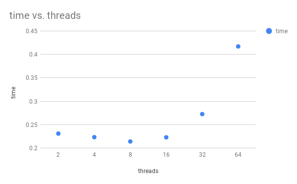
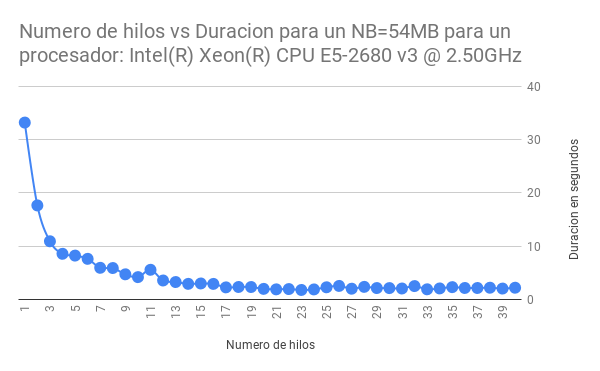

# curso-hcp-igp

## Clase 1

Ejemplos de introduccion a C, salida y entrada estandar (libreria stdio.h).

## Clase 2

Ejemplos de funciones, punteros y asignacion dinamica de memoria (libreria stdlib.h).

## Clase 3

Ejemplos de estructuras, hilos, barreras y herramienta gprof (libreria pthread.h).

## Clase 4

Ejemplos de sincronizacion con exclusion mutua, uniendo hilos, midiendo el tiempo de ejecucion, comparando programa serial vs paralelo y barreras (libreria pthread.h).

## Clase 5

Ejemplos de corrimiento de bits, principios de localidad espacial y temporal, orden por filas y asignacion continua de direcciones de memoria. (libreria time.h)

## Clase 6

Introduccion a fortran 95, ejemplos de salida y entrada estandar, numeros, bloques program, lazos do, condicionales if-else y funciones (paso por valor).

## Clase 7

Ejemplos de subrutinas (paso por referencia), bloques de modulos, alias de subrutinas, arreglos estaticos, arreglos dinamicos, arreglos de primer orden y segundo orden, numeros aleaorios con semilla, formato para numeros y cadenas de caracteres, estructuras de datos (type) y arreglo de estructuras (type).

## Laboratorio 1

* Programar una calculador con menu
* Programa multiplicacion de matrices cuadras

## Laboratorio 2

* Programar paralelizar la operacion de multiplicacion de matrices

